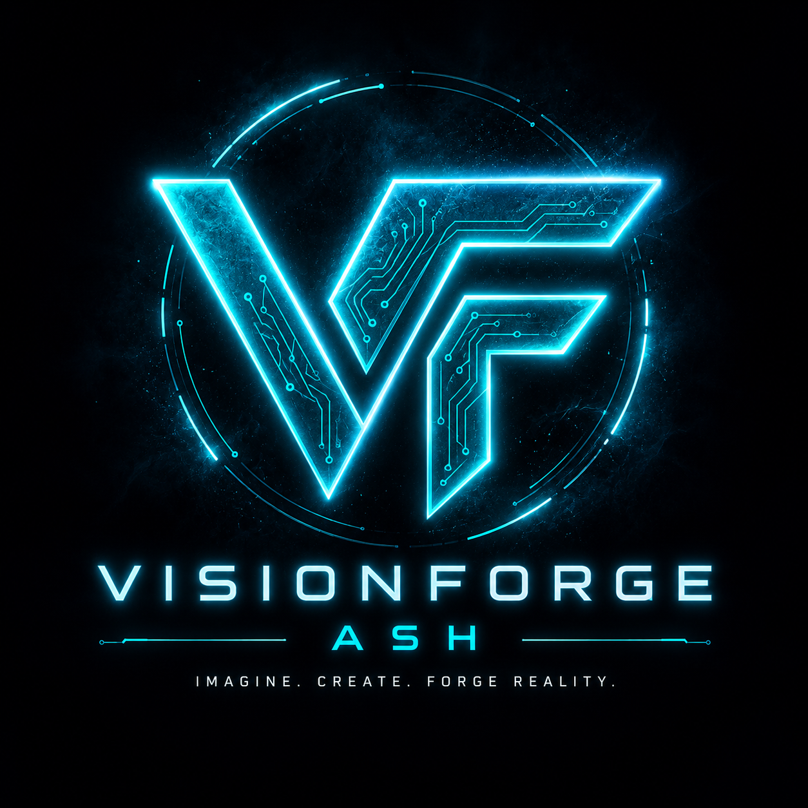
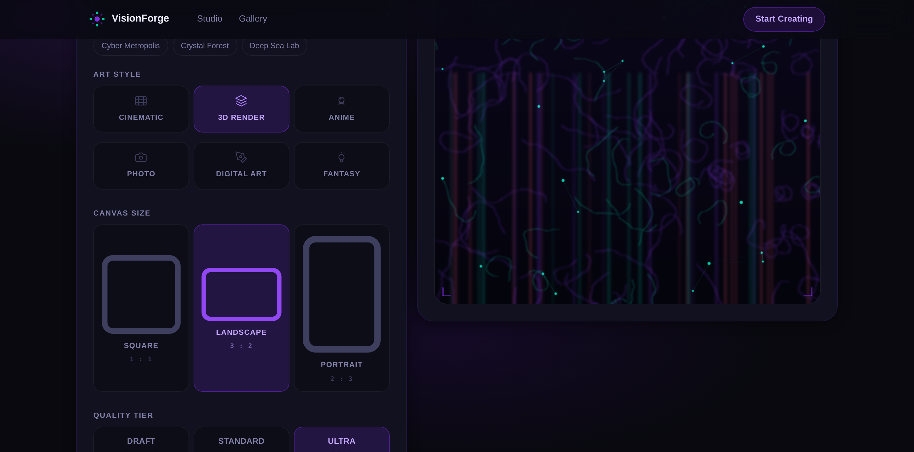
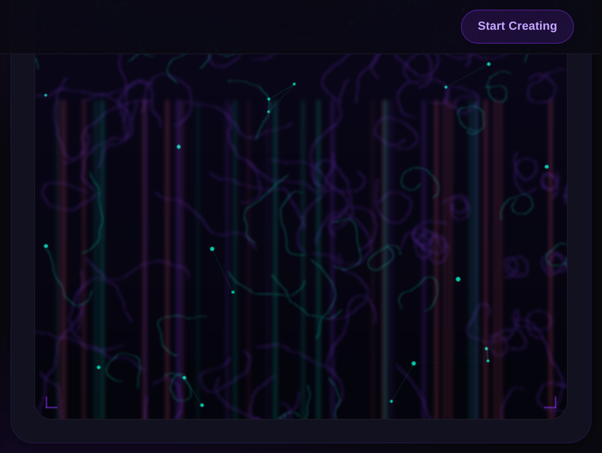
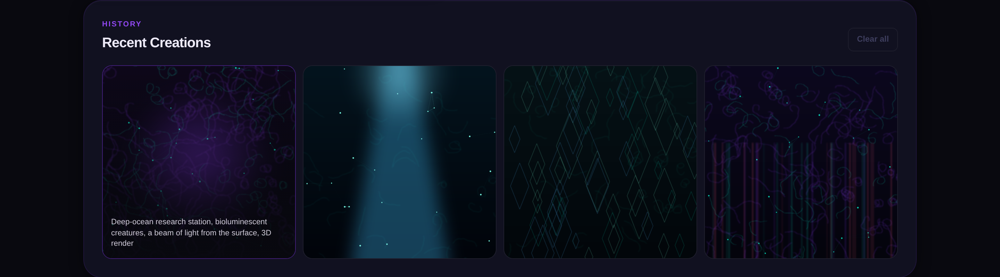
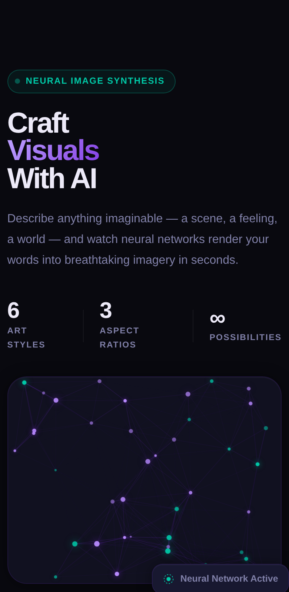

<div align="center">



# VisionForge

### Neural image synthesis studio — turn a sentence into cinematic imagery.

Describe a scene, a feeling, a world. VisionForge renders it through a polished, motion-driven studio interface with six art styles, three aspect ratios, and a built-in gallery.

<p>
<a href="https://ai-image-generator.achibane-dev.workers.dev/">

</a>
<a href="https://github.com/achrafdev89/ai-image-generator">

</a>

</p>

<br/>


</div>

---

## Overview

VisionForge is the front-of-house for an OpenAI image model, wrapped in a dark "obsidian / violet / mint" studio UI. The hero runs a live neural-network canvas animation; the workspace pairs a prompt builder with a real-time output canvas; and every creation drops into a local gallery so you can keep iterating without losing your work.

| | |
|---|---|
| **Live URL** | [🚀 Live Demo](https://ai-image-generator.achibane-dev.workers.dev/)|
| **Frontend** | Static HTML / CSS / vanilla JS, deployed on Cloudflare Workers |
| **Backend** | Express API on Render, calling OpenAI `gpt-image-2` |
| **Design** | Syne + DM Sans + JetBrains Mono · Obsidian `#09090F` · Violet `#7B2FE0` · Mint `#00C9A7` |

---

## Features

- **Six art styles** — Cinematic, 3D Render, Anime, Photorealistic, Digital Art, Fantasy Concept Art, selectable as icon cards.
- **Three aspect ratios** — Square `1:1`, Landscape `3:2`, Portrait `2:3`.
- **Three quality tiers** — Draft, Standard, and Ultra.
- **Quick-prompt chips** — one-tap starting points like *Cyber Metropolis* and *Crystal Forest*.
- **Live neural canvas** — an animated, GPU-friendly node graph in the hero that pauses when the tab is hidden.
- **Real generation feedback** — status pill, neural loader, and an animated progress bar.
- **One-click download** — save any result as a timestamped PNG.
- **Local gallery** — your last 16 creations persist in `localStorage`, with hover-to-read prompts and a clear-all control.
- **Built for everyone** — fully responsive, with ARIA roles, radiogroups, and live regions throughout.

---

## Screenshots

### Studio — prompt builder + output canvas


### Output preview


### Recent creations gallery


### Mobile


---

## Tech Stack

**Frontend**


**Backend**


**Infra & Tooling**


---

## Project Structure

```text
visionforge/
├── backend/
│   ├── server.js              # Express API -> OpenAI gpt-image-2
│   ├── .env.example           # OPENAI_API_KEY, PORT
│   └── package.json
├── frontend/
│   ├── index.html             # Studio markup
│   ├── style.css              # Obsidian / violet / mint design system
│   ├── script.js              # UI logic, neural canvas, gallery
│   └── assets/                # Logo + icons
├── scripts/
│   ├── capture-screenshots.js # Local auto-demo capture (offline, mocked)
│   ├── samples/               # Sample art used by the mocked API
│   └── package.json
├── screenshots/               # Generated images for this README
└── package.json               # Screenshot + demo scripts
```

---

## Getting Started

### 1. Clone

```bash
git clone https://github.com/achrafdev89/VisionForge.git
cd ai-image-generator
```

### 2. Run the backend

```bash
cd backend
npm install
cp .env.example .env        # then add your OPENAI_API_KEY
npm run dev                 # starts on http://localhost:5000
```

### 3. Run the frontend

The frontend is fully static. Point its API at your local backend, then serve it:

```js
// frontend/script.js
const API_URL = "http://localhost:5000/api/generate-image";
```

```bash
# from the project root
npx serve frontend          # or use VS Code "Live Server"
```

> In production the frontend (Cloudflare Workers) talks to the deployed Render API, so the committed `API_URL` points there. Swap it back when you deploy.

---

## Auto-Demo Screenshots

The README images and GIF are produced automatically — no manual cropping, no API key, no cost. `scripts/capture-screenshots.js` boots a tiny static server for `frontend/`, drives the real UI with Playwright, and **mocks the image API** with bundled sample art so it runs fully offline and deterministically.

```bash
# one-time setup
npm install
npx playwright install chromium

# capture the full screenshot set (offline, mocked API)
npm run screenshots

# capture against the deployed site instead
npm run screenshots:live

# rebuild the animated demo.gif from the recorded walkthrough (needs ffmpeg)
npm run demo:gif
```

Outputs land in `screenshots/`: `home.png`, `studio.png`, `result.png`, `gallery.png`, `mobile.png`, plus a recorded `walkthrough.webm` that feeds the GIF.

Useful flags:

```bash
node scripts/capture-screenshots.js --url <any-url>   # capture an arbitrary URL
node scripts/capture-screenshots.js --live            # use the real backend (needs network + key)
```

---

## How It Works

1. The studio collects a prompt plus the selected **style**, **size**, and **quality**.
2. `script.js` POSTs that payload to the API and shows the neural loader + progress bar.
3. The Express backend enriches the prompt, calls OpenAI `gpt-image-2`, and returns a base64 PNG.
4. The result renders on the output canvas, becomes downloadable, and is saved to the local gallery.

---

## Roadmap

- [x] Six art styles, three ratios, three quality tiers
- [x] Local gallery with persistence
- [x] Automated offline screenshot + demo pipeline
- [ ] User accounts and cloud-synced gallery
- [ ] Image upscaling and variations
- [ ] Shareable prompt links
- [ ] Community showcase

---

## Author

**Achraf Chibane**

<p>
<a href="https://github.com/achrafdev89">

</a>
<a href="https://linkedin.com/in/achraf-chibane">

</a>
</p>

---

<div align="center">

If VisionForge sparked something, leave a ⭐ on the repo.

</div>
